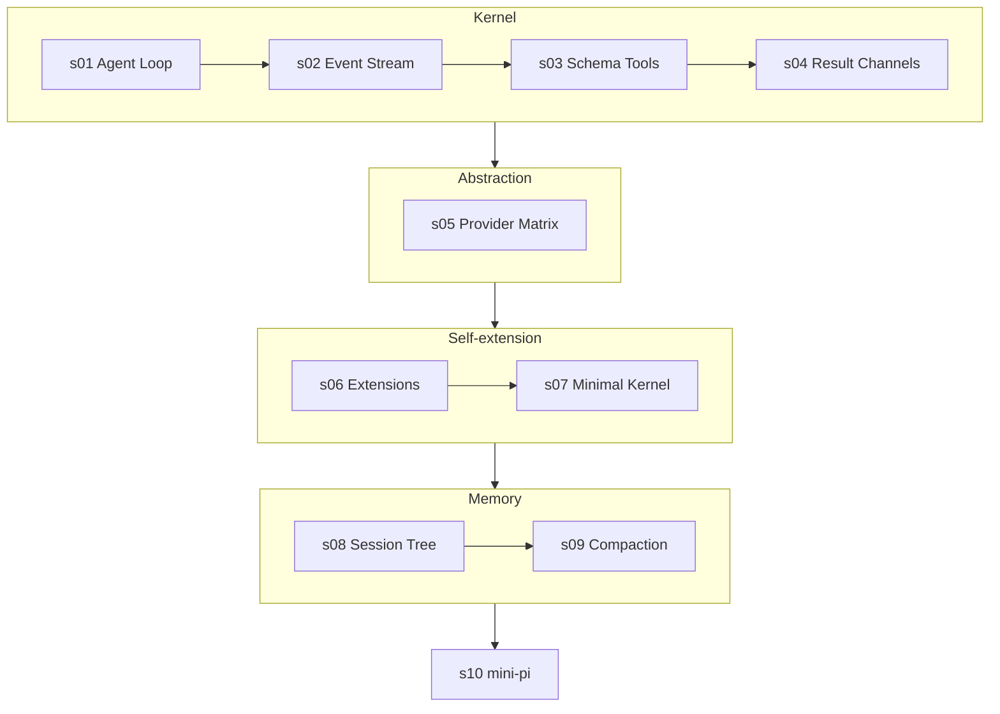

English | [中文](README.zh.md)

# Learn Pi — How to Build a Self-Extensible Coding Agent

> Companion course to [pi](https://github.com/earendil-works/pi) (by Mario Zechner / earendil-works).
> A 10-chapter, code-first tour of a coding agent harness that dares to have **no built-in permissions, no built-in sub-agents, no built-in MCP** — and gets away with it.

## The Thesis: The Thinner the Kernel, the Smarter the Extensions

Most coding agents grow by accretion: permissions here, plan mode there, sub-agents, MCP, todos, background shells — each baked into the core until the core is the product.

Pi takes the opposite bet, stated plainly in its own docs:

> "It intentionally does not include built-in MCP, sub-agents, permission popups, plan mode, to-dos, or background bash. You can build or install those workflows as extensions."

Strip pi down to its essence:

```
pi = one event-driven agent loop
   + schema-first tools (TypeBox-validated)
   + a unified LLM API layer (API × Provider, orthogonal)
   + an extension system with ~40 event types
   + a tree-shaped JSONL session store
   + token-aware compaction
   + ...and nothing else. Everything above is an extension.
```

The kernel does not decide what is safe. It does not know what a sub-agent is. It has never heard of MCP. It hosts; extensions act. This course rebuilds that architecture from scratch — chapter by chapter, in dependency-free, erasable TypeScript that runs directly on Node.

## What You Will Build

A **mini-pi**: roughly 1500 lines across 10 chapters, each standalone and runnable offline through a scripted **FauxProvider** (pi itself ships a 20KB faux provider for exactly this purpose — agent development that costs nothing and never flakes).

| Chapter | Topic | Motto | Key Concepts |
|---|---|---|---|
| [s01](s01_agent_loop/) | Agent Loop | *The loop is the kernel* | unified message model / `toolCall` blocks / faux provider |
| [s02](s02_event_stream/) | Event Stream | *Everything the loop does is an event* | async generator / `agent_start…agent_end` / multiple consumers |
| [s03](s03_schema_tools/) | Schema-First Tools | *A tool is a schema plus a handler* | TypeBox-style schema / validation / sequential vs parallel / tool changes declared into history |
| [s04](s04_tool_results/) | Tool Result Channels | *`content` for the model, `details` for the UI* | dual-channel results / streaming `onUpdate` / truncated-message defense / `terminate` |
| [s05](s05_provider_matrix/) | Provider Matrix | *API and Provider are orthogonal* | wire adapters / compat flags / 10 APIs × 40 providers / generated model catalog |
| [s06](s06_extensions/) | Extension System | *The kernel hosts; extensions act* | `ExtensionAPI` / typed events / `registerTool` / `beforeToolCall` blocking |
| [s07](s07_minimal_kernel/) | The Minimal Kernel | *What the kernel refuses to build, extensions provide* | approval-as-extension / subagent-as-extension / MCP-as-extension |
| [s08](s08_session_tree/) | Session Tree | *Sessions branch in place* | JSONL / `id`+`parentId` / fork without new files / replay |
| [s09](s09_compaction/) | Compaction | *Never cut between a call and its result* | token estimation / cut-point rules / summary entry / `firstKeptEntryId` |
| [s10](s10_mini_pi/) | mini-pi | *Thin kernel, thick ecosystem* | everything above, one runtime, ~300 lines |

## Learning Path



## How to Run

Every chapter is a **single dependency-free TypeScript file**, written in erasable-only syntax (no `enum`, no `namespace` — the same discipline pi's own `AGENTS.md` enforces, so Node can strip types without a build step).

```sh
# Node >= 22.18: run directly
node s01_agent_loop/code.ts

# Older Node 22.x:
node --experimental-strip-types s01_agent_loop/code.ts
```

All chapters default to the offline **FauxProvider** — no API key, no cost, deterministic output. Chapters s01 and s10 can optionally drive a real model via any OpenAI-compatible endpoint (DeepSeek works great):

```sh
PI_API_KEY=sk-... PI_BASE_URL=https://api.deepseek.com PI_MODEL=deepseek-chat \
  node s01_agent_loop/code.ts
```

## Project Structure

```
learn-pi/
  s01_agent_loop/        # one folder per chapter
    README.md            #   English chapter README
    README.zh.md         #   Chinese translation
    code.ts              #   standalone runnable implementation (zero deps)
  ...
  s10_mini_pi/
  README.md              # this file
```

## Map to the Real pi Source

| Course concept | Real location (under `pi/packages/`) |
|---|---|
| Agent loop | `agent/src/agent-loop.ts` (858 lines, two-layer while loop) |
| Event types | `agent/src/types.ts` (`AgentEvent`, `AgentTool`, `AgentLoopConfig`) |
| Tool schema / execution modes | `agent/src/types.ts`, `agent/src/agent-loop.ts` (`prepareToolCall`) |
| Tool changes declared into history | `agent/src/agent-loop.ts` → `declareToolChanges()` |
| Truncated-message defense | `agent/src/agent-loop.ts` → `failToolCallsFromTruncatedMessage()` |
| content/details dual channel | `agent/src/types.ts` → `AgentToolResult` |
| API × Provider + compat matrix | `ai/src/types.ts`, `ai/src/api/*.ts`, `ai/src/providers/all.ts` |
| Faux provider | `ai/src/providers/faux.ts` |
| Generated model catalog | `ai/src/models.generated.ts` (never hand-edited) |
| Extension API (~40 events) | `coding-agent/src/core/extensions/types.ts` (~1800 lines — the most important single file) |
| Extension loading (jiti) | `coding-agent/src/core/extensions/loader.ts` |
| Compaction | `coding-agent/src/core/compaction/compaction.ts` |
| JSONL session tree | `coding-agent/src/core/session-manager.ts` + `docs/session-format.md` |
| Project trust | `coding-agent/src/core/trust-manager.ts` |
| Built-in tools (only 8) | `coding-agent/src/core/tools/` (read, bash, edit, write, grep, find, ls, powershell) |

## How This Course Relates to learn-claude-code

[learn-claude-code](https://github.com/shareAI-lab/learn-claude-code) teaches harness engineering with Claude Code as the reference: 17 chapters, one mechanism each, Python + Anthropic API. This course applies the same method to pi — but pi inverts Claude Code's philosophy, so the lessons invert too: where Claude Code *builds mechanisms in*, pi *pushes them out to extensions*. Chapter s07 is the payoff: we implement permission approval, a sub-agent, and an MCP-style external tool **without touching a single line of the kernel**.

## License

MIT
