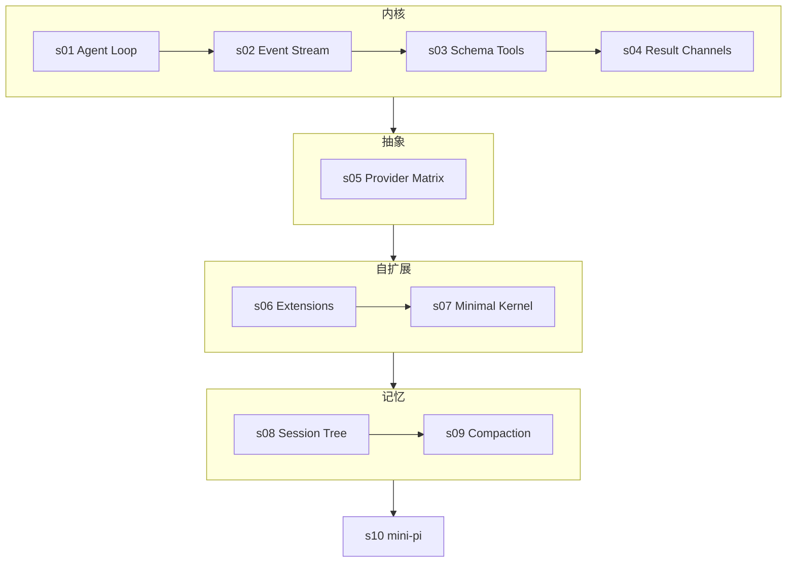

[English](README.md) | 中文

# Learn Pi — 如何构建一个可自我扩展的 Coding Agent

> 本课程是 [pi](https://github.com/earendil-works/pi)（Mario Zechner / earendil-works 出品）的配套学习仓库。
> 共 10 章，以代码为核心，带你走读一个**没有内置权限、没有内置子代理、没有内置 MCP** 却依然完整强大的 coding agent。

## 核心命题：内核越薄，扩展越强

大多数 coding agent 靠"堆功能"演进：权限塞进来、计划模式塞进来、子代理、MCP、todo、后台 shell……每一样都焊死在内核里，最后内核本身就变成了产品。

pi 下了一个反向的赌注，它的文档写得明明白白：

> "It intentionally does not include built-in MCP, sub-agents, permission popups, plan mode, to-dos, or background bash. You can build or install those workflows as extensions."
> （它刻意不内置 MCP、子代理、权限弹窗、计划模式、todo 和后台 bash。你可以把这些工作流作为扩展来构建或安装。）

把 pi 拆到只剩骨架：

```
pi = 一个事件驱动的 agent 循环
   + schema-first 工具（TypeBox 校验）
   + 统一 LLM API 层（API × Provider 正交）
   + 拥有约 40 种事件的扩展系统
   + 树形 JSONL 会话存储
   + token 感知的上下文压缩
   + ……没有别的了。以上"没有"的一切，都是扩展。
```

内核不决定什么是安全的，它根本不知道子代理是什么，更没听说过 MCP。**内核只搭台，扩展来唱戏。** 本课程从零重建这套架构——一章一个机制，全部用零依赖、可擦除 TypeScript 编写，直接跑在 Node 上。

## 你将构建什么

一个 **mini-pi**：10 章共约 1500 行代码，每章独立可运行，默认通过脚本化的 **FauxProvider**（假模型）离线运行（pi 自己就内置了一个 20KB 的 faux provider，目的完全相同——让 agent 开发零成本、不抖动）。

| 章节 | 主题 | 格言 | 关键概念 |
|---|---|---|---|
| [s01](s01_agent_loop/) | Agent Loop | *内核就是一个循环* | 统一消息模型 / `toolCall` 块 / faux provider |
| [s02](s02_event_stream/) | 事件流 | *循环的一切都是事件* | async generator / `agent_start…agent_end` / 多消费者 |
| [s03](s03_schema_tools/) | Schema-First 工具 | *工具 = schema + handler* | TypeBox 风格 schema / 校验 / 顺序与并行 / 工具变更写入历史 |
| [s04](s04_tool_results/) | 工具结果双通道 | *`content` 给模型，`details` 给界面* | 双通道结果 / 流式 `onUpdate` / 截断防御 / `terminate` |
| [s05](s05_provider_matrix/) | Provider 矩阵 | *API 与 Provider 正交* | 线协议适配器 / compat 开关 / 10 种 API × 40 家 Provider / 生成式模型目录 |
| [s06](s06_extensions/) | 扩展系统 | *内核只搭台，扩展来唱戏* | `ExtensionAPI` / 类型化事件 / `registerTool` / `beforeToolCall` 拦截 |
| [s07](s07_minimal_kernel/) | 最小内核 | *内核不做的，恰恰是扩展要做的* | 审批即扩展 / 子代理即扩展 / MCP 即扩展 |
| [s08](s08_session_tree/) | 会话树 | *会话原地分叉* | JSONL / `id`+`parentId` / 不建新文件的分叉 / 回放 |
| [s09](s09_compaction/) | 上下文压缩 | *永远别把调用和结果切开* | token 估算 / 切点规则 / 摘要条目 / `firstKeptEntryId` |
| [s10](s10_mini_pi/) | mini-pi | *薄内核，厚生态* | 以上全部，一个运行时，约 300 行 |

## 学习路径



## 如何运行

每一章都是**一个零依赖的 TypeScript 单文件**，只用可擦除语法（不用 `enum`、不用 `namespace` —— 与 pi 自己 `AGENTS.md` 的纪律一致，Node 无需构建即可剥掉类型直接运行）：

```sh
# Node >= 22.18：直接运行
node s01_agent_loop/code.ts

# 较老的 Node 22.x：
node --experimental-strip-types s01_agent_loop/code.ts
```

所有章节默认使用离线 **FauxProvider** —— 无需 API key、零成本、输出确定。s01 与 s10 可选接入任意 OpenAI 兼容端点的真实模型（DeepSeek 就很好用）：

```sh
PI_API_KEY=sk-... PI_BASE_URL=https://api.deepseek.com PI_MODEL=deepseek-chat \
  node s01_agent_loop/code.ts
```

## 项目结构

```
learn-pi/
  s01_agent_loop/        # 每章一个目录
    README.md            #   英文章节文档
    README.zh.md         #   中文翻译
    code.ts              #   独立可运行实现（零依赖）
  ...
  s10_mini_pi/
  README.md              # 本文件
```

## 对照真实 pi 源码

| 课程概念 | 真实位置（`pi/packages/` 下） |
|---|---|
| Agent 循环 | `agent/src/agent-loop.ts`（858 行，双层 while 循环） |
| 事件类型 | `agent/src/types.ts`（`AgentEvent`、`AgentTool`、`AgentLoopConfig`） |
| 工具 schema / 执行模式 | `agent/src/types.ts`、`agent/src/agent-loop.ts`（`prepareToolCall`） |
| 工具变更写入历史 | `agent/src/agent-loop.ts` → `declareToolChanges()` |
| 截断防御 | `agent/src/agent-loop.ts` → `failToolCallsFromTruncatedMessage()` |
| content/details 双通道 | `agent/src/types.ts` → `AgentToolResult` |
| API × Provider + compat 矩阵 | `ai/src/types.ts`、`ai/src/api/*.ts`、`ai/src/providers/all.ts` |
| Faux provider | `ai/src/providers/faux.ts` |
| 生成式模型目录 | `ai/src/models.generated.ts`（禁止手改） |
| Extension API（约 40 种事件） | `coding-agent/src/core/extensions/types.ts`（约 1800 行，全项目最重要的单一文件） |
| 扩展加载（jiti） | `coding-agent/src/core/extensions/loader.ts` |
| 上下文压缩 | `coding-agent/src/core/compaction/compaction.ts` |
| JSONL 会话树 | `coding-agent/src/core/session-manager.ts` + `docs/session-format.md` |
| 项目信任 | `coding-agent/src/core/trust-manager.ts` |
| 内置工具（仅 8 个） | `coding-agent/src/core/tools/`（read、bash、edit、write、grep、find、ls、powershell） |

## 与 learn-claude-code 的关系

[learn-claude-code](https://github.com/shareAI-lab/learn-claude-code) 以 Claude Code 为参照讲授 harness 工程：17 章、每章一个机制、Python + Anthropic API。本课程用同样的方法论剖析 pi——但 pi 颠倒了 Claude Code 的哲学，所以课程重点也随之颠倒：Claude Code 把机制**造进内核**，pi 把机制**推到扩展层**。第 7 章是全课程的收束：我们实现权限审批、子代理、MCP 式外部工具，**内核一行代码都不用改**。

## 许可

MIT
